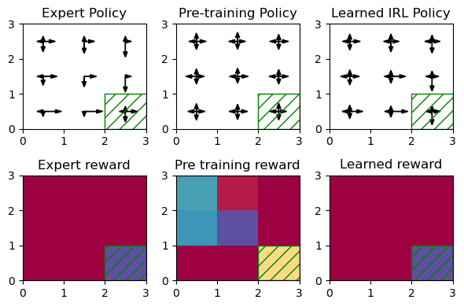
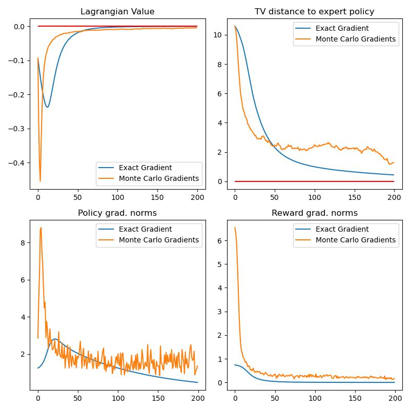

# (Constrained) Inverse Reinforcement Learning : Algorithms and Experiments



RL experiment environment for my master project "[Provable Convergence Guarantees for Constrained Inverse Reinforcement Learning](https://infoscience.epfl.ch/record/304492?ln=en)" and for the paper that will come out of it.

The following repository contains. 
1. An **environment** (`env`) module, that contains a Markov Decision Process class, samplers to generate trajectories from MDPs and specific MDP implementations (specifically a Gridworld environment and a random MDP generator). These MDPs are implemented in such a way that it is easy to compute exact gradients on them using `jax` automatic differentiation.
1. An **algorithm** (`alg`) module that implements policy gradient computation (both natural PG and vanilla PG) as well as reward gradient computation and constraint-lagrange mutliplier computation (both using exact and stochastic differentiation). It allows for solving, RL, IRL and CIRL problems. The algorithms are implemented in `jax` and aim to be as close as possible to the mathematical formulation (as they serve as experiments for the theory paper).

The file structure is as follows:
```
.
├── algs            // ------------- RL algorithms -------------
│   ├── grads.py            // gradient computations
│   ├── projs.py            // projection operations
│   ├── irl.py              // IRL helper functions
│   ├── pg.py               // PG helper functions
│   ├── opt.py              // optimizer module
│   ├── metrics.py          // training metrics
│   ├── returns.py          // Loss/Return computations
│   ├── train.py            // training wrapper functions
│   └── utils.py            // utilities
├── env             // ------------ RL environments ------------
│   ├── mdp.py              // MDP class
│   ├── sample.py           // Sampler class
│   ├── complete.py         // random MDP generation
│   ├── gridworld.py        // gridworld environment
│   └── utils.py            //utilities
├── examples        // ------------ figures --------------------
│   └── ....
├── notebooks       // ---- example jupyter notebooks ----------
│   ├── bandirs_example.ipynb   // examples of bandit training
│   ├── irl_example.ipynb       // examples of IRL training
│   └── pg_example.ipynb        // examples of PG training
│
├── readme.md               // this readme
├── requirements.txt        // this readme
└── run.py                  // experiments script
└── plots.py                 // generate plots from logs
```

The code is intended to be run with `python 3.9`. The dependencies are specified in the `requirements.txt` file which can be installed with pip.

To run the experiments run:
```shell
python run.py # run the experiments
python plots.py # generate the plots and save them to the examples folder
```

the example training curves look like this:




This is a test to show Tingting.